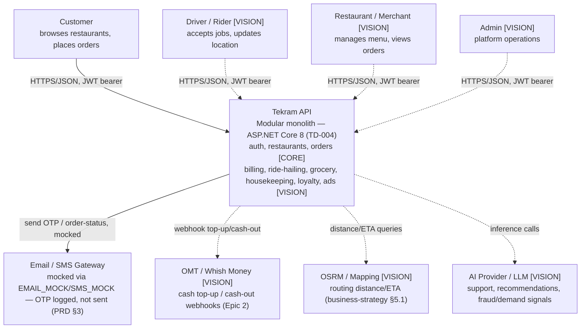
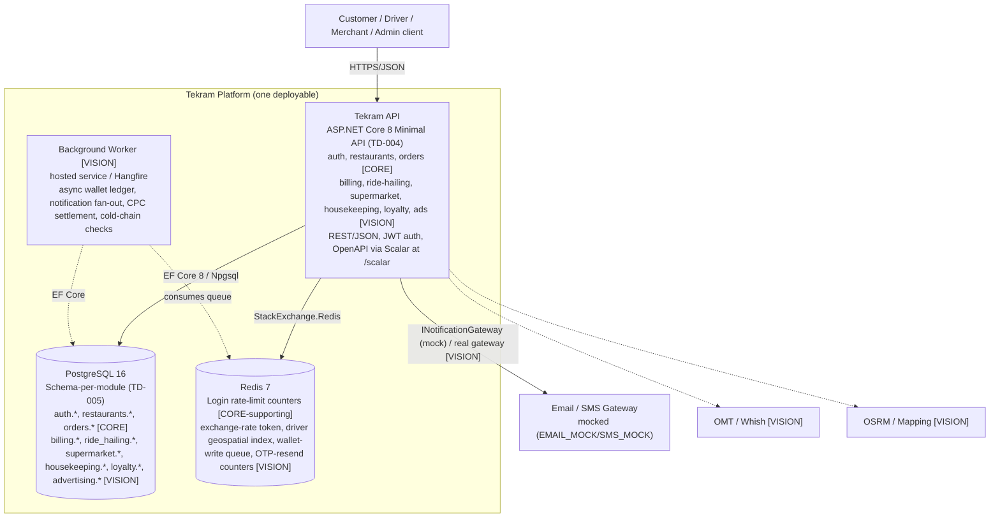
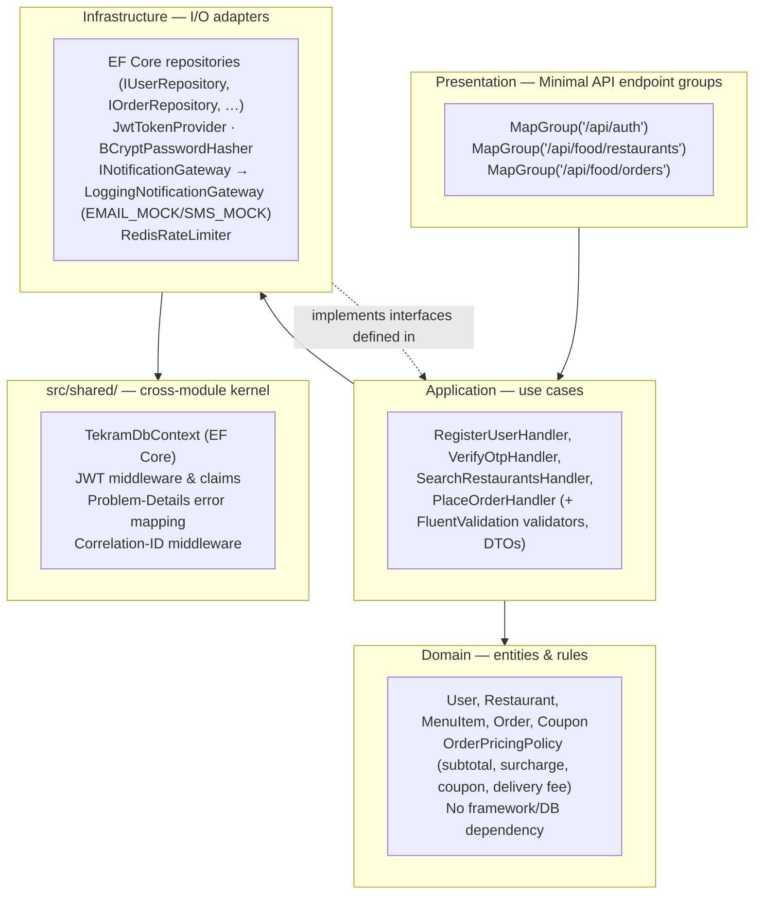
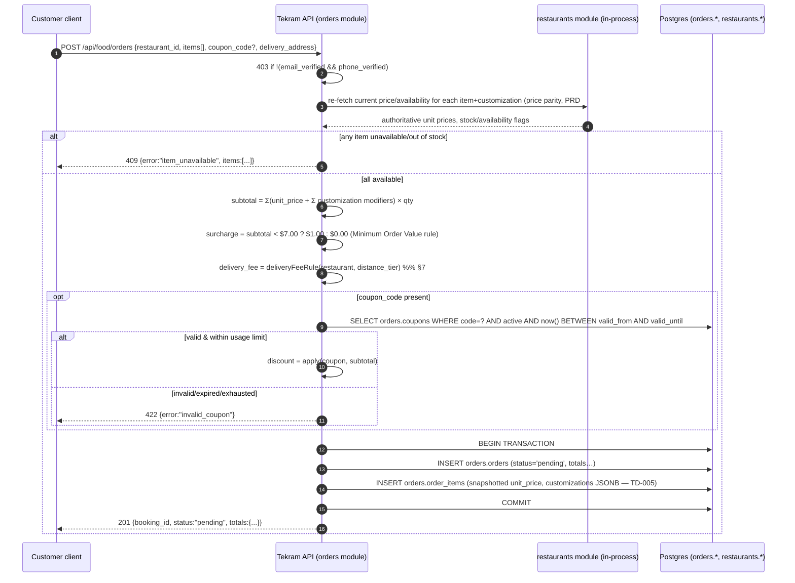
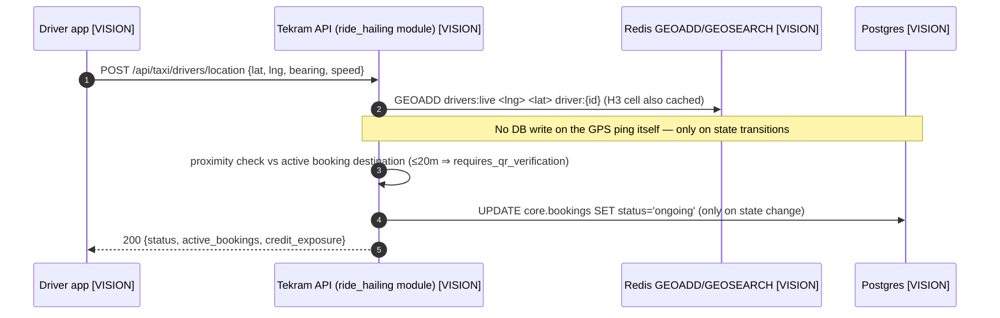

# Tekram — Architecture (Part 1)

**Document reference:** `docs/architecture.md` — deliverable for assessment Part 1 (Architecture,
20%, hard gate ≥15/20). Companion documents: [docs/database-schema.md](./database-schema.md)
(Part 3), [docs/02-prd.md](./02-prd.md) (functional spec + build-scope classification),
[docs/technical-decisions.md](./technical-decisions.md) (TD-001…TD-005, referenced throughout).
**Date:** 2026-07-08. **Scale target (brief-given):** 1M registered users, 50k DAU, 15k orders/day.

> **Scope discipline.** Per [02-prd.md §3](./02-prd.md#3-build-scope-classification-gradable-core-vs-strategic-vision),
> only **auth (incl. OTP verification) + restaurant browse/menu + order placement** are built and
> graded in Part 2. Everything else in this document — grocery, ride-hailing, housekeeping,
> billing/wallet, loyalty, ads, and every "future vertical" the brief names — is the architecture
> **designed to support**, not code that exists. Every section below is labeled **[CORE]** (built),
> **[CORE-supporting]** (built to enable a core flow), or **[VISION]** (designed, not built) so the
> grading of Part 1 (design quality) is never confused with the grading of Part 2 (what runs).

---

## 1. System context

Tekram is a single backend platform (Part 2 scope: food delivery only) designed to extend, without
a rebuild, into a multi-vertical super-app (taxi, supermarket, housekeeping, and beyond). One API
serves every client; clients differ only by which endpoints and roles they exercise.



**Why one system, not one-per-vertical.** [TD-001](./technical-decisions.md#td-001--modular-monolith-not-microservices-for-now)
— at 15k orders/day (~0.17 req/s sustained) a service-per-vertical split buys nothing but
operational overhead. One deployable, directory-level module boundaries, extraction path defined
and ready when growth actually demands it.

---

## 2. Containers (C4 Level 2)



| Container | Status | Notes |
|---|---|---|
| Tekram API | **CORE** | Single ASP.NET Core 8 process. Stateless — horizontally replicable behind a load balancer without code changes (§8). |
| PostgreSQL | **CORE** | System of record. One instance for dev/local (`docker-compose.yml`, TD-002); managed HA Postgres in production (§10). |
| Redis | **CORE-supporting** | Used in the graded build only for login rate-limiting; every other listed use is vision. Its absence would not break order placement — it's a resilience/performance layer, not a source of truth. |
| Background Worker | **VISION** | Not started for Part 2. Architecture reserves the seam (`INotificationGateway`, `IWalletLedgerQueue` interfaces) so a worker process is a lift, not a redesign, when async volume justifies it. |

---

## 3. Components — module layering (C4 Level 3, informal)

Each module (`src/auth/`, `src/restaurants/`, `src/orders/`) is a **vertical slice** through the
same four layers. Layers are folders, not separate `.csproj` projects
([TD-004](./technical-decisions.md#td-004--net-8-aspnet-core-as-the-backend-stack)) — this keeps
the parallel-engineer merge model in [00-project-management-plan.md §6](./00-project-management-plan.md#6-parallel-execution-model)
working (disjoint directories, no shared-project reference churn).



**Dependency rule:** Presentation → Application → Domain; Infrastructure implements interfaces
*declared by* Application (dependency inversion), never the reverse — this is the "Clean
Architecture" bonus criterion from the brief's Part 2, expressed as folders rather than assemblies.
Domain has zero dependency on ASP.NET Core, EF Core, or Redis, so pricing/verification rules are
unit-testable without a database (xUnit, per TD-004).

**Module boundary rule (TD-001):** a module may call another module's Application-layer interface
(e.g. `orders` calls `restaurants.IMenuPricingReader` to re-verify item prices — PRD #13 AC
"price parity verification") but never reaches into another module's Infrastructure or Domain
internals, and never queries another module's tables directly — same rule the eventual
service-extraction boundary would need, kept alive from day one.

---

## 4. API design conventions

- **Base path:** `/api/...` (matches every route literal in [02-prd.md §5](./02-prd.md#5-atomic-api-issues)).
  No `/v1` prefix for the graded build — a single unversioned surface is appropriate at this
  scope; **[VISION]** once external merchant/partner integrations exist, version at the path
  (`/api/v1/...`) rather than the header, for cache- and log-friendliness.
- **Envelope:** list endpoints return `{ data: [...], pagination: {...} }`
  (or `{ "<entity>": [...], pagination: {...} }` where the PRD names the array, e.g. `transactions`);
  single-resource endpoints return the resource directly — matches every response example in the PRD.
- **Errors:** [RFC 7807](https://www.rfc-editor.org/rfc/rfc7807) Problem Details JSON
  (`type`, `title`, `status`, `detail`, plus a stable machine-readable `error` code such as
  `verification_required`, matching PRD #13's named error). Centralized in ASP.NET Core's
  exception-handling middleware — handlers throw typed domain exceptions
  (`DuplicateEmailException`, `StockUnavailableException`), never construct HTTP responses by hand.
- **Pagination:** query params `page` (default 1) / `limit` (default per-endpoint, capped — 10/50
  for restaurants, 20/100 for ledger — exact defaults per PRD acceptance criteria); response echoes
  `current_page`, `limit`, `total_items`, `total_pages`.
- **Auth:** `Authorization: Bearer <JWT>`. No API keys/cookies for the graded build — mobile/web
  client only.
- **Docs:** native `Microsoft.AspNetCore.OpenApi` document + **Scalar** UI at `/scalar` in
  non-production environments (TD-004) — satisfies Part 2's "API documentation" deliverable and
  Part 8's "API documentation" requirement from one source of truth (the endpoint definitions
  themselves), not a hand-maintained doc that drifts.

---

## 5. Authentication & authorization [CORE]

```mermaid
sequenceDiagram
    autonumber
    participant C as Customer client
    participant API as Tekram API (auth module)
    participant DB as Postgres (auth.*)
    participant Log as App log (EMAIL_MOCK/SMS_MOCK)

    C->>API: POST /api/auth/register {name,email,phone,password,role}
    API->>API: validate (FluentValidation) + BCrypt hash password
    API->>DB: INSERT auth.users (email_verified=false, phone_verified=false)
    API->>DB: INSERT billing.wallets [VISION] (0.00 USD)
    API->>DB: INSERT auth.otp_codes x2 (email, phone; hashed; 10-min expiry)
    API->>Log: write OTP codes (mock gateway — no real send)
    API-->>C: 201 {user, token, token_expires_at}

    C->>API: POST /api/auth/verify/email {code}
    API->>DB: SELECT latest unconsumed auth.otp_codes WHERE channel='email'
    alt code valid, unexpired, unused
        API->>DB: UPDATE otp_codes SET consumed_at=now(); UPDATE users SET email_verified=true
        API-->>C: 200 {email_verified:true, phone_verified:false, fully_verified:false}
    else invalid/expired
        API-->>C: 422 {error:"invalid_or_expired_code"}
    end

    C->>API: POST /api/auth/login {identifier, password}
    API->>API: Redis: check rate-limit (5 / 15 min per identifier+IP)
    API->>DB: SELECT user by email or phone
    API->>API: BCrypt.Verify(password, hash)
    API-->>C: 200 {user, token, token_expires_at} or 401 generic
```

- **Token:** JWT (`Microsoft.AspNetCore.Authentication.JwtBearer`), claims = `sub` (user id),
  `role`, `exp`. Short-lived access token only in the graded core (no refresh token) — the PRD's
  login/register response shape has no refresh field. **[VISION]** refresh tokens are designed at
  the schema level (`auth.sessions`, [database-schema.md](./database-schema.md#3-sessions-vision))
  for later multi-device logout/revocation, but issuing them is out of Part 2 scope.
- **Password storage:** BCrypt (`BCrypt.Net-Next`), cost factor 12. Brief allows BCrypt or
  Argon2id; BCrypt chosen for zero native-dependency friction in a 72-hour build.
  Argon2id is the noted upgrade path if a future security review calls for it.
- **Role-based authorization:** `[Authorize(Roles = "customer,driver,merchant,admin")]`-equivalent
  policy per endpoint group, driven by the `role` JWT claim. Order placement additionally checks
  the **verification gate** — `email_verified && phone_verified` — returning `403
  verification_required` otherwise (PRD #2A/#13), enforced in the Application layer (not just the
  route), so no future endpoint can accidentally skip it.
- **Rate limiting:** ASP.NET Core's built-in rate-limiter middleware, fixed-window policy keyed on
  `identifier + IP`, 5 attempts / 15 min for login and 3 resends / 15 min per OTP channel. Backed
  by Redis (`StackExchange.Redis` distributed counter) so the limit holds even once the API scales
  to multiple replicas (§8) — an in-memory counter would reset per-instance and silently weaken
  the control.
- **Transport security:** HTTPS-only (HSTS in production), CORS locked to known client origins,
  secrets never logged (Serilog destructuring policy strips `password`/`token` fields).

---

## 6. Core data flows

### 6.1 Restaurant browse & search [CORE]

```mermaid
sequenceDiagram
    autonumber
    participant C as Customer client
    participant API as Tekram API (restaurants module)
    participant DB as Postgres (restaurants.*)

    C->>API: GET /api/food/restaurants?search=&cuisine=&price_tier=&page=&limit=
    API->>DB: SELECT restaurants.restaurants WHERE status='active' AND filters (idx: status, cuisine; GIN trigram on name)
    DB-->>API: rows + total_count
    API-->>C: 200 {data:[...], pagination:{...}}

    C->>API: GET /api/food/restaurants/{id}/menu
    API->>DB: SELECT restaurant + menu_categories + menu_items + customization groups/options (idx: restaurant_id)
    API->>API: is_available = (stock_count is null) OR (stock_count > 0)
    API-->>C: 200 {restaurant_id, categories:[...]}
```

> **Graded-core simplification (PRD #11 note):** H3 geofencing, CPC sponsor prioritization, and
> live OSRM delivery-fee routing are **[VISION]**. The graded build returns a documented flat/
> tiered delivery-fee estimate (§7) computed at order time, not a live routing call.

### 6.2 Order placement [CORE]



> **Graded-core simplification (PRD #13 note):** the vision extras — TPT `core.bookings` /
> `food_delivery.food_orders` split, `FoodOrderPlacedEvent` dispatch, `billing.ledger` legs,
> wallet payment — are **[VISION]**. The graded build persists directly to `orders.orders` /
> `orders.order_items` (see [database-schema.md](./database-schema.md)) and supports
> `payment_method: COD` only; `WALLET` is schema-reserved but not wired up.

### 6.3 Extensibility proof — a [VISION] high-frequency flow

Shown to demonstrate the platform's design anticipates workloads the relational store should
never see directly (driver GPS at up to 200Hz per active driver) — the brief explicitly asks Part
1 to plan for Taxi/future verticals, not just describe what Part 2 builds.



This is the concrete reason Redis is in the container diagram (§2) even though the graded build
barely touches it: the seam exists so this flow is a **module addition**, not an architecture
change, when Taxi is built.

---

## 7. Pricing & business-rule placement [CORE]

All monetary rules live in Domain (`OrderPricingPolicy`), not scattered across handlers, so Part 3
schema and Part 2 code agree on one source of truth:

| Rule | Value (graded core) | Vision extension |
|---|---|---|
| Minimum Order Value | $7.00 USD | Configurable per restaurant [VISION] |
| Small-order surcharge | $1.00 USD flat, applied when subtotal < MOV | Dynamic surcharge curve (business-strategy §4.4.C) [VISION] |
| Delivery fee | Documented flat/zone-tier rule (e.g. $1.50 base + $0.50 per zone beyond the first, capped) computed from restaurant→address zone, **not** live routing | OSRM scooter-profile routing distance × per-km rate [VISION] |
| Coupon discount | Percent or fixed, validated against `orders.coupons` (active, date window, usage cap) | Merchant-funded vs platform-funded coupon split, stacking rules [VISION] |
| Currency | USD only; all `price_usd` columns are the source of truth | Dynamic USD→LBP display conversion via a 60-second rate token (business-strategy §5.4, PRD Epic 2) [VISION] |

---

## 8. Scalability

**Capacity math at brief-given scale.** 15k orders/day ≈ 0.17 orders/sec sustained; even a 10×
lunch/dinner peak multiplier (~1.7 orders/sec, and each order touches maybe 5–10 read queries
around it for menu/price lookups) is comfortably inside what one ASP.NET Core instance + one
right-sized Postgres instance serves — the growth strategy pivots by capacity, not by day-one
over-engineering:

1. **Stateless API, horizontal-first.** The API holds no in-process session state (JWT is
   self-contained); scaling out is adding replicas behind a load balancer, no code change. Redis
   rate-limit counters are already externalized (§5) specifically so this holds.
2. **Read-heavy hot path (restaurant search).** Add a Postgres read replica once search read
   volume separates from order-write volume; cache restaurant-listing pages in Redis with a short
   TTL (seconds) before reaching for a replica — cheaper first lever.
3. **Write-heavy hot path (orders) at 10× volume.** Partition `orders.orders` by `created_at`
   (monthly range partitions) — keeps indexes small and lets old-order archival be a partition
   detach instead of a `DELETE` (see [database-schema.md §7](./database-schema.md#7-scaling-notes)).
4. **Connection pooling.** `Npgsql` pooling in-process today; add PgBouncer once replica count or
   connection count from horizontally-scaled API instances exceeds Postgres's practical
   `max_connections` headroom.
5. **Microservice extraction trigger** ([TD-001](./technical-decisions.md#td-001--modular-monolith-not-microservices-for-now)):
   ~150k orders/day, >10–12 engineers, or a vertical needing an independent availability/compliance
   tier. Extraction order: notifications → search/discovery → dispatch/matching → payments — the
   module boundaries in §3 are already the future service contracts.
6. **Multi-vertical geospatial load (Taxi/food dispatch at scale) [VISION]:** driver location
   never touches Postgres per-ping (§6.3) — this is the one place the design pre-empts a scaling
   problem the graded build doesn't have yet, because retrofitting it after Taxi launches with
   live traffic would be materially harder than building the seam now.

---

## 9. Security

- **Input validation** at the Application boundary (FluentValidation) — Lebanese phone format
  (`+961` + 7–8 digits), password strength (8+ chars, 1 digit, 1 uppercase), coordinate bounds for
  Lebanon (lat 33.0–34.7, lng 35.0–36.6) **[VISION — Address Book]**.
  See [database-schema.md](./database-schema.md) for column-level constraints.
- **SQL injection:** EF Core parameterizes every query by construction; no raw SQL string
  concatenation anywhere in the module Infrastructure layers.
- **Secrets:** `.NET User Secrets` in local dev, environment variables in CI, **Azure Key Vault
  in production [VISION — full detail in docs/devops.md, Part 5]**. `EMAIL_MOCK=true` /
  `SMS_MOCK=true` are the only "mock" switches — no other subsystem in this codebase is ever
  mocked, so a passing test suite means the real Postgres/Redis path actually works.
- **Enumeration resistance:** login returns a generic `401` for both "no such user" and "wrong
  password"; OTP verification returns a generic `422` for both "wrong code" and "expired code."
- **Least privilege:** the API's Postgres role is scoped to the schemas it owns
  (`auth`, `restaurants`, `orders` today); no `superuser`/DDL privilege at runtime — migrations run
  under a separate elevated role in CI/CD, never the app's runtime connection string.
- **Auditability:** every monetary mutation (order creation, **[VISION]** wallet debit/credit) is
  a single transaction with an immutable row — no `UPDATE` of a settled total, only new
  compensating rows (**[VISION]** — the graded core has no compensating-transaction flow to
  audit yet, since it has no cancellation/refund endpoint).

---

## 10. Logging, monitoring & disaster recovery

- **Structured logging:** Serilog → console (dev) / JSON sink. Every request gets a correlation
  ID (middleware) threaded through logs, so a single order's full request trace is one `grep`.
- **Health check:** `/healthz` (DB + Redis connectivity) for load-balancer/orchestrator probes.
- **Metrics to track from day one** (ties into Part 9's business-thinking dashboards):
  orders/min, order failure rate by error code, OTP verification success rate, p95 latency per
  endpoint group, login rate-limit trip rate. **[VISION]** shipped via OpenTelemetry to
  Azure Monitor/Grafana — full pipeline in [docs/devops.md](./devops.md) (Part 5, not yet
  written — DevOps detail belongs there, not duplicated here per this project's doc-scope rule).
- **Backups / RPO-RTO:** managed Postgres automated backups + point-in-time recovery
  (**[VISION]** production target: RPO ≤ 5 min via WAL shipping, RTO ≤ 30 min via standby
  promotion). Redis holds no durable state for the graded core (rate-limit counters only) — it is
  rebuildable from empty with no data-loss risk, which is precisely why nothing load-bearing is
  allowed to live there without a Postgres backing record (§7, order totals are always persisted
  to Postgres, never left only in cache).
- **Rollback strategy:** blue/green or canary API deploys (stateless replicas make this cheap,
  §8); EF Core migrations are additive-first (add column nullable → backfill → make non-null in a
  later deploy) so a rollback of the API binary never strands the schema — full CI/CD pipeline
  detail is Part 5's [docs/devops.md](./devops.md).

---

## 11. Extending to every future vertical the brief names

The brief asks Part 1 to plan for "Pharmacy, Parcel Delivery, AI Features, Loyalty Platform,
Merchant Dashboard, and Rider App Improvements" beyond the four core verticals. None of these are
built; this table is the concrete "how it would plug in" answer the rubric's "weak architecture
rationale" auto-fail concern is checking for.

| Future vertical | Reuses | New surface needed |
|---|---|---|
| **Pharmacy** | `supermarket.*` catalog/safety-stock pattern (Epic 4), `core.bookings` TPT base, delivery-fee/coupon rules (§7) | Prescription-upload/verification step before checkout; regulated-item flag on catalog items |
| **Parcel Delivery** | `core.bookings` TPT base, driver dispatch (`ride_hailing` matching, §6.3) | No catalog/menu concept — a booking with sender/receiver addresses and a package-size tier instead of line items |
| **AI Features** | `INotificationGateway`-style interface seam — an `IAiAssistant`/`IRecommendationEngine` interface behind the same DI pattern already used for notifications, so a real LLM call is a swap, not a rewrite | New `src/ai/` module; see [docs/ai-strategy.md](./ai-strategy.md) (Part 7) for the feature list (support, recommendations, fraud, demand forecasting) |
| **Loyalty Platform** | `orders.orders`/`billing.ledger` as the event source for points accrual (Epic 7, PRD #28) | `loyalty.points_ledger`, tier calculation job |
| **Merchant Dashboard** | Read-only projections over `restaurants.*`, `orders.*`, `advertising.*` (Epic 7 ads) — a BFF read model, not new source-of-truth tables | New `merchant` JWT role + endpoint group; materialized views for order/revenue reporting so dashboard queries never contend with checkout writes |
| **Rider App Improvements** | Offline-first design already scoped at the business-strategy level (business-strategy §5.3): local action queue, reconcile-on-reconnect | Client-side concern primarily; server side needs idempotent state-transition endpoints (already true of `core.bookings` transitions) so a replayed offline action is a no-op, not a duplicate |

---

## 12. CI/CD (summary — full detail in Part 5)

- **GitHub Actions:** on every PR — `dotnet build`, `dotnet test` (xUnit against a throwaway
  Postgres/Redis service container, mirroring the lane model in
  [00-project-management-plan.md §6](./00-project-management-plan.md#6-parallel-execution-model)),
  `dotnet ef migrations has-pending-model-changes` as a drift guard.
- **On merge to `main`:** build container image, run migrations against the target environment,
  deploy. **[VISION]** target platform (Azure App Service vs. AKS), secrets wiring, and rollback
  mechanics are Part 5's job — see [docs/devops.md](./devops.md) once written. Documenting it twice
  would violate this project's own doc-scope-discipline rule (each concern owned by exactly one
  doc); this section exists only so Part 1 isn't silent on CI/CD, which the brief separately
  flags as an auto-fail concern if ignored entirely.

---

## 13. Deliverable-path ↔ module map

| Module | Directory (PRD-locked, [02-prd.md §3](./02-prd.md#3-build-scope-classification-gradable-core-vs-strategic-vision)) | Postgres schema (TD-005) | Status |
|---|---|---|---|
| Auth | `src/auth/` | `auth` | **CORE** |
| Restaurants | `src/restaurants/` | `restaurants` | **CORE** |
| Orders | `src/orders/` | `orders` | **CORE** |
| Shared kernel | `src/shared/` | — (cross-schema: `TekramDbContext`) | **CORE-supporting** (scaffold, lands first per [00-project-management-plan.md §6](./00-project-management-plan.md#6-parallel-execution-model)) |
| Tests | `tests/` | — | **CORE** |
| Billing/Wallet | `src/billing/` *(not created)* | `billing` | VISION |
| Ride-hailing | `src/ride_hailing/` *(not created)* | `ride_hailing` | VISION |
| Supermarket | `src/supermarket/` *(not created)* | `supermarket` | VISION |
| Housekeeping | `src/housekeeping/` *(not created)* | `housekeeping` | VISION |
| Loyalty/Subscriptions/Ads | `src/loyalty/`, `src/ads/` *(not created)* | `loyalty`, `advertising` | VISION |

Full column-level schema: [docs/database-schema.md](./database-schema.md).
