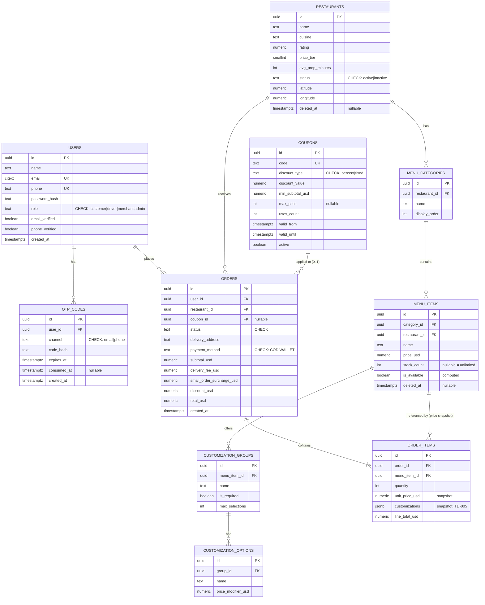
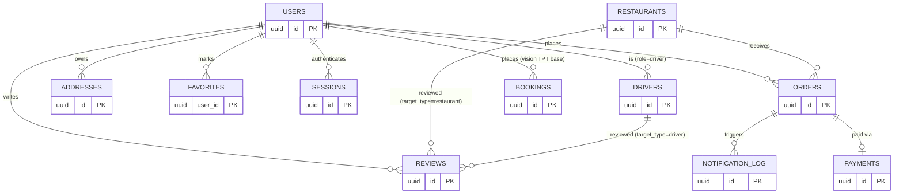

# Tekram — Database Design (Part 3)

**Document reference:** `docs/database-schema.md` — deliverable for assessment Part 3 (Database
Design, 10%). Companion: [docs/architecture.md](./architecture.md) (Part 1, §3 layering / §13
module map), [docs/technical-decisions.md](./technical-decisions.md) (TD-005 schema-per-module +
JSONB snapshot rationale), [docs/02-prd.md](./02-prd.md) (endpoint contracts these tables serve).
**Engine:** PostgreSQL 16, EF Core 8 code-first migrations (TD-004).

> **Scope discipline.** The brief's Part 3 prompt names twelve entities regardless of what Part 2
> builds: *Users, Restaurants, Menus, Orders, Payments, Drivers, Promotions, Ratings, Address
> Book, Favorites, Sessions, Notifications.* Every one is designed below. Each table is tagged
> **[CORE]** (created by the Part 2 migration, has real rows), or **[VISION]** (designed here,
> not migrated — the extension point for a vertical/feature this assessment doesn't build). Do
> not read a **[VISION]** table as something the running API writes to.

---

## 1. Design principles

1. **Schema-per-module** ([TD-005](./technical-decisions.md#td-005--postgres-schema-per-module-jsonb-snapshot-for-order-customizations)):
   table ownership mirrors the module boundaries from
   [TD-001](./technical-decisions.md#td-001--modular-monolith-not-microservices-for-now) —
   `auth.*`, `restaurants.*`, `orders.*` today; `payments.*`, `drivers.*`, `ratings.*`,
   `notifications.*`, and a cross-vertical `core.*` schema are designed for later modules. This
   makes a future service extraction a schema-boundary lift, not a table-by-table archaeology dig.
2. **UUID primary keys** (`gen_random_uuid()`, `pgcrypto` extension) everywhere — matches every ID
   shown in the PRD's JSON examples, and avoids leaking sequential order/user counts to clients.
3. **Money as `numeric(10,2)` in USD**, never float. USD is the ledger currency
   (business-strategy §5.4); LBP is always a display-time conversion, never stored as the
   authoritative amount **[VISION — multi-currency display]**.
4. **`text` + `CHECK` instead of native Postgres `ENUM`** for status/role/channel columns.
   Native `ENUM` types can't have a value added inside a transaction in Postgres — a `CHECK`
   constraint is a normal, transactional `ALTER TABLE`, which matters for a schema that will grow
   a `status` value (e.g. a new order state) far more often than a full migration cycle allows.
5. **Every table gets `created_at timestamptz not null default now()`**; mutable tables also get
   `updated_at` maintained by an EF Core `SaveChanges` interceptor (not a DB trigger — keeps the
   mutation logic in one place, in C#, testable without a live database).
6. **Soft-delete is explicit, not default.** Only `restaurants.restaurants` and
   `restaurants.menu_items` get a `deleted_at timestamptz null` (a delisted restaurant/item must
   disappear from search but its historical orders must still resolve its name/price). Every other
   table either has no delete path in the graded core, or vision-level cancellation is modeled as
   a `status` transition, not a row deletion.

---

## 2. Entity-relationship diagram — graded core [CORE]



## 3. DDL — graded core [CORE]

```sql
create extension if not exists pgcrypto;
create extension if not exists pg_trgm;      -- restaurant name search
create extension if not exists citext;       -- case-insensitive email

create schema if not exists auth;
create schema if not exists restaurants;
create schema if not exists orders;

-- =========================== auth ===========================

create table auth.users (
    id              uuid primary key default gen_random_uuid(),
    name            text not null,
    email           citext not null,
    phone           text not null,
    password_hash   text not null,
    role            text not null check (role in ('customer','driver','merchant','admin')),
    email_verified  boolean not null default false,
    phone_verified  boolean not null default false,
    created_at      timestamptz not null default now(),
    updated_at      timestamptz not null default now(),
    constraint uq_users_email unique (email),
    constraint uq_users_phone unique (phone),
    constraint ck_users_phone_lebanese check (phone ~ '^\+961[0-9]{7,8}$')
);

create table auth.otp_codes (
    id           uuid primary key default gen_random_uuid(),
    user_id      uuid not null references auth.users(id) on delete cascade,
    channel      text not null check (channel in ('email','phone')),
    code_hash    text not null,
    expires_at   timestamptz not null,
    consumed_at  timestamptz null,
    created_at   timestamptz not null default now()
);
-- fast "latest unconsumed code for this user+channel" lookup (PRD #2A verify/resend)
create index ix_otp_codes_user_channel_active
    on auth.otp_codes (user_id, channel, created_at desc)
    where consumed_at is null;

-- =========================== restaurants ===========================

create table restaurants.restaurants (
    id                uuid primary key default gen_random_uuid(),
    name              text not null,
    description       text null,
    cuisine           text not null,
    rating            numeric(2,1) not null default 0.0,
    price_tier        smallint not null check (price_tier between 1 and 4),
    avg_prep_minutes  int not null,
    status            text not null default 'active' check (status in ('active','inactive')),
    latitude          numeric(9,6) not null,
    longitude         numeric(9,6) not null,
    created_at        timestamptz not null default now(),
    updated_at        timestamptz not null default now(),
    deleted_at        timestamptz null
);
create index ix_restaurants_status_cuisine on restaurants.restaurants (status, cuisine) where deleted_at is null;
create index ix_restaurants_name_trgm on restaurants.restaurants using gin (name gin_trgm_ops);

create table restaurants.menu_categories (
    id             uuid primary key default gen_random_uuid(),
    restaurant_id  uuid not null references restaurants.restaurants(id) on delete cascade,
    name           text not null,
    display_order  int not null default 0
);
create index ix_menu_categories_restaurant on restaurants.menu_categories (restaurant_id, display_order);

create table restaurants.menu_items (
    id             uuid primary key default gen_random_uuid(),
    category_id    uuid not null references restaurants.menu_categories(id) on delete cascade,
    restaurant_id  uuid not null references restaurants.restaurants(id) on delete cascade,
    name           text not null,
    description    text null,
    price_usd      numeric(10,2) not null check (price_usd >= 0),
    stock_count    int null,  -- null = unlimited/not tracked
    created_at     timestamptz not null default now(),
    updated_at     timestamptz not null default now(),
    deleted_at     timestamptz null
);
create index ix_menu_items_restaurant on restaurants.menu_items (restaurant_id) where deleted_at is null;
-- is_available is derived (stock_count is null or stock_count > 0), not stored — avoids a second
-- place that can drift from the number that actually gates checkout (orders.orders re-reads stock_count).

create table restaurants.menu_item_customization_groups (
    id              uuid primary key default gen_random_uuid(),
    menu_item_id    uuid not null references restaurants.menu_items(id) on delete cascade,
    name            text not null,
    is_required     boolean not null default false,
    max_selections  int not null default 1
);

create table restaurants.menu_item_customization_options (
    id                    uuid primary key default gen_random_uuid(),
    group_id              uuid not null references restaurants.menu_item_customization_groups(id) on delete cascade,
    name                  text not null,
    price_modifier_usd    numeric(10,2) not null default 0
);

-- =========================== orders ===========================

create table orders.coupons (           -- satisfies the brief's "Promotions" entity
    id               uuid primary key default gen_random_uuid(),
    code             text not null,
    discount_type    text not null check (discount_type in ('percent','fixed')),
    discount_value   numeric(10,2) not null check (discount_value > 0),
    min_subtotal_usd numeric(10,2) not null default 0,
    max_uses         int null,
    uses_count       int not null default 0,
    valid_from       timestamptz not null,
    valid_until      timestamptz not null,
    active           boolean not null default true,
    constraint uq_coupons_code unique (code),
    constraint ck_coupons_window check (valid_until > valid_from)
);

create table orders.orders (
    id                          uuid primary key default gen_random_uuid(),
    user_id                     uuid not null references auth.users(id),
    restaurant_id               uuid not null references restaurants.restaurants(id),
    coupon_id                   uuid null references orders.coupons(id),
    status                      text not null default 'pending'
        check (status in ('pending','confirmed','preparing','out_for_delivery','delivered','cancelled')),
    delivery_address            text not null,   -- simplified vs Address Book (§5) per PRD #13 graded-core note
    payment_method              text not null check (payment_method in ('COD','WALLET')),
    subtotal_usd                numeric(10,2) not null check (subtotal_usd >= 0),
    delivery_fee_usd            numeric(10,2) not null default 0,
    small_order_surcharge_usd   numeric(10,2) not null default 0,
    discount_usd                numeric(10,2) not null default 0,
    total_usd                   numeric(10,2) not null check (total_usd >= 0),
    created_at                  timestamptz not null default now(),
    updated_at                  timestamptz not null default now()
);
create index ix_orders_user_created on orders.orders (user_id, created_at desc);
create index ix_orders_restaurant_status on orders.orders (restaurant_id, status);

create table orders.order_items (
    id                 uuid primary key default gen_random_uuid(),
    order_id           uuid not null references orders.orders(id) on delete cascade,
    menu_item_id       uuid not null references restaurants.menu_items(id),
    quantity           int not null check (quantity > 0),
    unit_price_usd     numeric(10,2) not null,   -- snapshot at order time (TD-005)
    customizations     jsonb null,               -- snapshot [{group,option,price_modifier_usd}], TD-005
    line_total_usd     numeric(10,2) not null
);
create index ix_order_items_order on orders.order_items (order_id);
```

---

## 4. Vision entities — schema for every remaining brief-named entity [VISION]

These complete the brief's twelve-entity list. None of these tables are migrated by the Part 2
build; they exist here so a reviewer can see the concrete extension point for each, not just a
promise that "it would extend."

### 4.1 Drivers

```sql
create schema if not exists drivers;

create table drivers.drivers (
    id                    uuid primary key default gen_random_uuid(),
    user_id               uuid not null references auth.users(id),   -- role='driver'
    vehicle_type          text not null check (vehicle_type in ('scooter','sedan')),  -- business-strategy §4.1 dual-engine fleet
    license_plate         text not null,
    rating                numeric(2,1) not null default 5.0,
    status                text not null default 'offline' check (status in ('offline','available','on_trip')),
    security_deposit_usd  numeric(10,2) not null default 0,           -- Net Exposure formula, business-strategy §5.4
    created_at            timestamptz not null default now()
);
-- Live coordinates deliberately do NOT live here — Redis GEOADD/GEOSEARCH (architecture.md §6.3).
-- A Postgres row per GPS ping at 200Hz/driver would be the single fastest way to fall over at scale.
```

### 4.2 Payments

Generalized across every vertical (food, taxi, supermarket, housekeeping) so adding a vertical
never means adding a new payments table — one row per booking payment attempt, regardless of
which module the booking belongs to.

```sql
create schema if not exists payments;

create table payments.payments (
    id                 uuid primary key default gen_random_uuid(),
    booking_id         uuid not null,   -- points at orders.orders.id today; core.bookings.id once §4.5 lands
    method             text not null check (method in ('COD','WALLET','CARD')),
    status              text not null default 'pending' check (status in ('pending','captured','failed','refunded')),
    amount_usd         numeric(10,2) not null,
    gateway_reference  text null,       -- OMT/Whish/card-processor transaction id
    created_at         timestamptz not null default now()
);
create index ix_payments_booking on payments.payments (booking_id);
-- Graded core intentionally does NOT route through this table: `orders.orders.payment_method`
-- is inline (COD only, wired up). Introducing a generic payments table before a second vertical
-- exists to share it with would be the premature-abstraction this project's own rules warn against.
```

### 4.3 Ratings

```sql
create schema if not exists ratings;

create table ratings.reviews (
    id            uuid primary key default gen_random_uuid(),
    booking_id    uuid not null,       -- orders.orders.id today
    user_id       uuid not null references auth.users(id),
    target_type   text not null check (target_type in ('restaurant','driver')),
    target_id     uuid not null,       -- restaurants.restaurants.id or drivers.drivers.id
    food_rating   smallint null check (food_rating between 1 and 5),
    rider_rating  smallint null check (rider_rating between 1 and 5),
    comment       text null,
    created_at    timestamptz not null default now(),
    constraint uq_reviews_booking_user unique (booking_id, user_id)  -- one review per order per user
);
create index ix_reviews_target on ratings.reviews (target_type, target_id);
-- restaurants.restaurants.rating (§3) is a periodically-recomputed aggregate over this table,
-- not written transactionally on every review insert — keeps checkout's write path untouched by review volume.
```

### 4.4 Address Book & Favorites

Both are cross-vertical concerns (an address or a favorite restaurant is meaningful to food,
supermarket, and housekeeping alike) — owned by a shared `core` schema rather than any one
vertical module, matching the PRD's own `core.addresses` naming (PRD Epic 1, issues #3–#6).

```sql
create schema if not exists core;

create table core.addresses (
    id                     uuid primary key default gen_random_uuid(),
    user_id                uuid not null references auth.users(id) on delete cascade,
    city                   text not null,
    district               text null,
    street_name            text null,
    building_name          text null,
    floor                  text null,
    apartment              text null,
    nearest_landmark       text not null check (length(btrim(nearest_landmark)) >= 5),  -- PRD #3 AC
    additional_directions  text null,
    latitude               numeric(9,6) not null check (latitude between 33.0 and 34.7),   -- Lebanon bounds, PRD #3
    longitude              numeric(9,6) not null check (longitude between 35.0 and 36.6),
    address_label          text not null check (address_label in ('Home','Work','Other')),
    created_at             timestamptz not null default now()
);
create index ix_addresses_user on core.addresses (user_id);

create table core.favorites (
    user_id           uuid not null references auth.users(id) on delete cascade,
    favoritable_type  text not null check (favoritable_type in ('restaurant','supermarket','housekeeper')),
    favoritable_id    uuid not null,
    created_at        timestamptz not null default now(),
    primary key (user_id, favoritable_type, favoritable_id)
);
```

### 4.5 Sessions

The graded core issues a stateless, short-lived JWT only (no refresh token — matches the PRD's
login/register response shape exactly, which has no refresh field). This table is the designed
extension point for multi-device session listing/revocation, not something the running API writes
today.

```sql
create table auth.sessions (
    id                uuid primary key default gen_random_uuid(),
    user_id           uuid not null references auth.users(id) on delete cascade,
    refresh_token_hash text not null,
    device_label      text null,
    issued_at         timestamptz not null default now(),
    expires_at        timestamptz not null,
    revoked_at        timestamptz null
);
create index ix_sessions_user_active on auth.sessions (user_id) where revoked_at is null;
```

### 4.6 Notifications

Distinct from `auth.otp_codes` (§3, which is narrowly the OTP-verification mechanism and is
**CORE**): this is the general outbound-notification log any module can append to, and what a real
`EMAIL_MOCK=false`/`SMS_MOCK=false` gateway swap (architecture.md §5) would write through.

```sql
create schema if not exists notifications;

create table notifications.notification_log (
    id          uuid primary key default gen_random_uuid(),
    user_id     uuid not null references auth.users(id),
    channel     text not null check (channel in ('email','sms','push')),
    type        text not null,           -- 'order_status_change', 'otp', 'promo', …
    payload     jsonb not null,
    status      text not null default 'pending' check (status in ('pending','sent','failed')),
    sent_at     timestamptz null,
    created_at  timestamptz not null default now()
);
create index ix_notification_log_user on notifications.notification_log (user_id, created_at desc);
```

### 4.7 The cross-vertical booking pattern (`core.bookings`)

Every vertical's "place an order/ride/booking" endpoint (PRD #13, #17, #20, #24) writes a base row
here plus a vertical-specific extension table (Table-per-Type) — this is what lets Payments,
Ratings, and Notifications above reference one `booking_id` type regardless of vertical, and it's
the concrete mechanism behind [architecture.md §11](./architecture.md#11-extending-to-every-future-vertical-the-brief-names)'s
"Pharmacy/Parcel reuse `core.bookings`" claim.

```sql
create table core.bookings (
    id            uuid primary key default gen_random_uuid(),
    user_id       uuid not null references auth.users(id),
    vertical      text not null check (vertical in ('food','taxi','supermarket','housekeeping','pharmacy','parcel')),
    status        text not null,
    total_usd     numeric(10,2) not null,
    created_at    timestamptz not null default now()
);
-- food_delivery.food_orders(booking_id PK/FK -> core.bookings.id, restaurant_id, …) would extend this 1:1.
-- Migration note: orders.orders (graded core, §3) is the pre-TPT shape of this same concept — moving
-- to core.bookings + food_delivery.food_orders is the concrete step when a second vertical ships,
-- not a rewrite (the columns move, the application-layer contract barely changes).
```

---

## 5. Full-platform ERD (adds §4 to §2)



---

## 6. Index summary

| Table | Index | Serves |
|---|---|---|
| `auth.users` | unique (email), unique (phone) | login lookup, duplicate rejection (PRD #1) |
| `auth.otp_codes` | partial (user_id, channel, created_at desc) where consumed_at is null | "latest active code" lookup (PRD #2A) without scanning consumed history |
| `restaurants.restaurants` | (status, cuisine) partial where not deleted; GIN trigram (name) | listing filters + case-insensitive substring search (PRD #11) |
| `restaurants.menu_items` | (restaurant_id) partial where not deleted | menu retrieval (PRD #12) |
| `orders.orders` | (user_id, created_at desc); (restaurant_id, status) | "my orders" history; merchant order queue **[VISION dashboard]** |
| `orders.order_items` | (order_id) | order detail assembly |
| `core.addresses` | (user_id) | address book listing **[VISION]** |
| `ratings.reviews` | (target_type, target_id); unique (booking_id, user_id) | rating aggregation; one-review-per-order **[VISION]** |
| `auth.sessions` | partial (user_id) where not revoked | active-session listing **[VISION]** |

---

## 7. Scaling notes

- **Read replica for search.** `restaurants.restaurants`/`menu_items` reads (browse/search) are
  far more frequent than writes (menu edits) — a Postgres read replica, or a short-TTL Redis cache
  in front of it, absorbs that skew without touching the write path order placement depends on.
- **Partition `orders.orders` by `created_at`** (monthly range partitions) once order volume
  approaches the [architecture.md §8](./architecture.md#8-scalability) 10× trigger — keeps the
  `(user_id, created_at)` index small and turns "archive last year's orders" into a partition
  detach instead of a table-wide `DELETE`.
- **`GIN` trigram index, not `LIKE '%...%'` table scans**, for restaurant name search — the index
  chosen in §3 already avoids the most common "search feature that works in dev, times out in
  prod" failure mode at this data size.
- **Connection pooling.** Npgsql's built-in pool suffices for a single API instance; once the API
  scales out horizontally (architecture.md §8), add PgBouncer in transaction-pooling mode so
  replica count × per-instance pool size doesn't exceed Postgres `max_connections`.
- **Driver location is never a Postgres write path** (§4.1) — the one place this schema
  deliberately keeps a high-frequency vertical (Taxi) out of the relational store entirely, by
  design, before it's ever built.
- **JSONB customization snapshot (TD-005), not a join table**, keeps `order_items` a
  single-row-per-line-item read with no extra join on the hottest read path (order confirmation,
  order history) — a normalized alternative would cost a join per line item for data that never
  changes after checkout.
