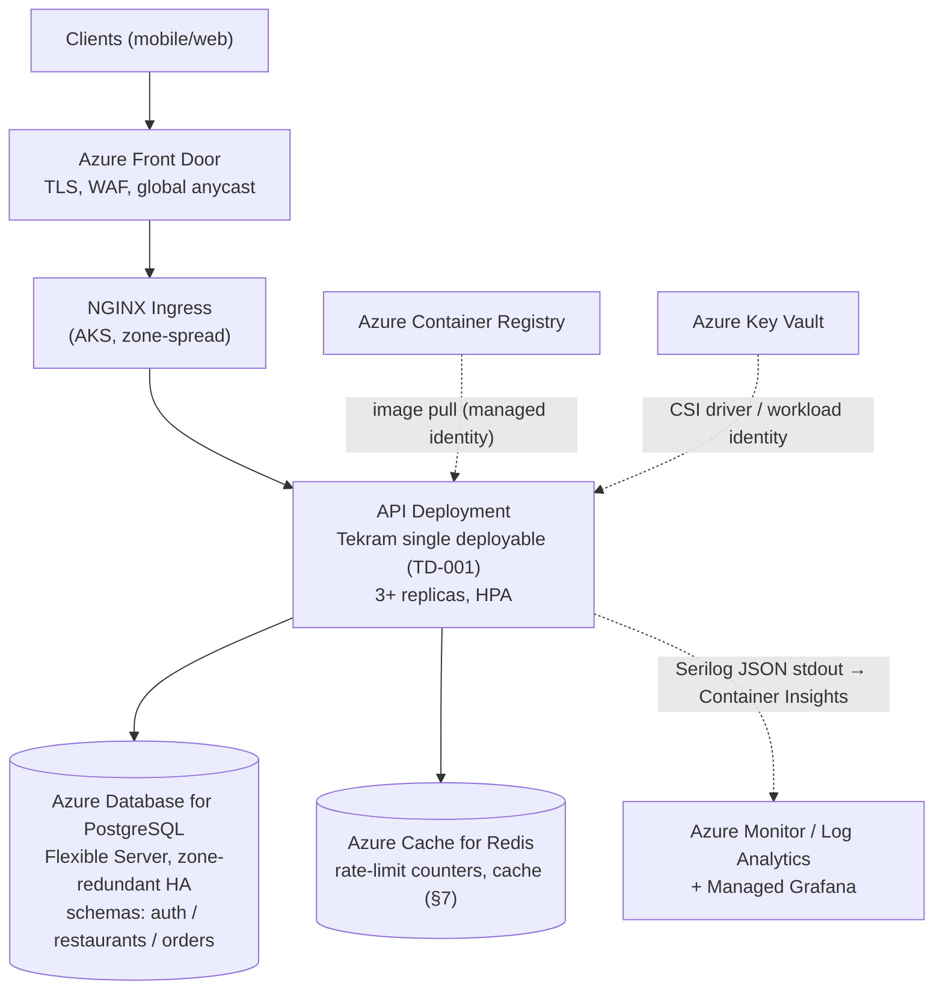

# Tekram — DevOps & Infrastructure (Part 5)

**Document reference:** `docs/devops.md` — deliverable for assessment Part 5 (DevOps &
Infrastructure, 10 pts). Companion documents: [docs/architecture.md](./architecture.md) §12
(the CI/CD summary this document expands — that summary stays the summary),
[docs/technical-decisions.md](./technical-decisions.md) (TD-001 modular monolith / single
deployable, TD-002 shared compose stack, TD-004 .NET 8 stack),
[docs/database-schema.md](./database-schema.md) (Part 3). **Date:** 2026-07-11.

> **Scope discipline.** Same labeling as Part 1: **[CORE]** exists and runs in this repo,
> **[VISION]** is the production design the assessment asks for but which no cloud subscription
> backs today. The CI pipeline (§2) is **[CORE]** — it is a working artifact,
> [`.github/workflows/ci.yml`](../.github/workflows/ci.yml). Everything Azure-side
> (§4–§11) is **[VISION]**, designed so that the CORE artifacts (containerized single
> deployable, additive-first migrations, `/healthz`, stateless replicas) drop into it without
> rework.

---

## 1. Environments

| Environment | Status | Infra | Data | Purpose |
|---|---|---|---|---|
| **Local dev** | [CORE] | `docker compose up -d` — `postgres:16-alpine` on **5432**, `redis:7-alpine` on **6379** (one shared stack, TD-002) | `tekram` DB + lane DBs (`tekram_lane1..3`) | Development + the full integration/e2e suites against real Postgres/Redis (architecture §9: nothing but email/SMS is ever mocked) |
| **CI** | [CORE] | GitHub Actions runner + throwaway service containers mirroring compose (same images, same ports) | Empty DB created per run, destroyed with the runner | The PR gate (§2) |
| **Staging** | [VISION] | Scaled-down copy of production (§5): 1-node AKS pool, burstable Postgres tier | Anonymized subset or seed data — never production PII | Pre-release smoke + migration rehearsal |
| **Production** | [VISION] | §5 | System of record | Serves traffic |

Configuration follows the secrets ladder (§8): the *same* appsettings keys everywhere, with only
the source of the values changing per environment — no environment-specific code paths.

---

## 2. CI — the pull-request gate [CORE]

Artifact: [`.github/workflows/ci.yml`](../.github/workflows/ci.yml). Triggers: every PR and every
push to `main`. This is architecture §12's first bullet, made concrete:

| Stage | Command | Fails the PR when |
|---|---|---|
| Restore + build | `dotnet build Tekram.sln -warnaserror` | Compile error or new warning (the codebase builds warning-clean today; CI keeps it that way) |
| Migration drift guard | `dotnet ef migrations has-pending-model-changes` | The EF model changed without a checked-in migration — catches the "works on my machine, breaks on deploy" class before merge |
| Integration tests | `dotnet test Tekram.sln` (`tests/Tekram.Tests` — WebApplicationFactory against the service containers) | Any test fails |
| Black-box e2e (TD-008) | Boot the API (`dotnet run` against the service DB, wait on `/healthz`), then `dotnet test tests/e2e` with `E2E_BASE_URL` pointing at it — the e2e project is deliberately outside `Tekram.sln`: it tests the API over HTTP like a real client, so CI must run it the same way | Any test fails, or the API never comes healthy |

Pipeline mechanics, chosen deliberately:

- **Service containers, not mocks.** The job declares `postgres:16-alpine` and `redis:7-alpine`
  service containers with the same health checks as `docker-compose.yml` (`pg_isready`,
  `redis-cli ping`). CI therefore exercises the identical dependency versions a laptop does —
  a green check means the real Postgres/Redis path works, which is the entire point of the
  no-mocks rule.
- **Toolchain pinning.** `actions/setup-dotnet` reads [`global.json`](../global.json)
  (SDK `8.0.303`), so CI and every dev machine compile with the same SDK. Toolchain drift is a
  solved problem, not a debugging session.
- **NuGet caching** keyed on the lock/csproj hashes — keeps the gate fast enough (~2–3 min) that
  nobody is tempted to skip it.
- **Branch protection [VISION-lite]:** `main` requires the CI check; merge authority is already
  procedural in this repo (architect-review gate) and becomes mechanical in a team setting.

---

## 3. CD — merge to `main` [VISION]

Architecture §12's second bullet, expanded. On merge to `main`:

1. **Build & tag image.** Multi-stage Dockerfile (`sdk:8.0` build stage → `aspnet:8.0` runtime
   stage, non-root user); tag with the git SHA — immutable, traceable, trivially rollback-able
   (§11). Push to **Azure Container Registry (ACR)**.
2. **Run migrations as a separate step, before rollout.** `dotnet ef database update` (bundled as
   an EF migration bundle in the image) runs as a one-shot job against the target database using
   the **elevated migration role** — the runtime connection string has no DDL privilege
   (architecture §9, least privilege). Migrations are additive-first (§11), so this step is safe
   to run while the previous binary still serves traffic.
3. **Deploy** the new image to staging, run a smoke probe (`/healthz` + one read endpoint), then
   promote the *same image digest* to production via canary (§6). Build once, promote the
   artifact — never rebuild per environment.
4. **Notify + record**: the pipeline annotates the deployment in Azure Monitor so every latency
   or error-rate graph carries deploy markers — the first question in any incident is "what
   changed", and this answers it for free.

Deployment cadence target: every merged PR is deployable; actual promotion to production is a
button (environment approval in GitHub Environments), not a ceremony.

---

## 4. Deployment platform: AKS, and why not the simpler thing [VISION]

Architecture §12 left "App Service vs AKS" open as Part 5's decision. Decision: **AKS**, with
eyes open about the trade-off:

- **What App Service would buy:** at 15k orders/day (~0.2 orders/sec sustained), a single App
  Service plan with 2–3 instances would carry the graded core with near-zero platform
  operations. If Tekram were only a food-delivery API, that would be the right answer, and
  choosing Kubernetes for it would be résumé-driven infrastructure.
- **Why AKS wins here:** the platform is designed (TD-001, architecture §11) to grow into taxi
  dispatch, supermarket, housekeeping, and background workers (notification fan-out, OTP
  dispatch, forecast jobs) with **different scaling profiles**. AKS gives: per-workload
  autoscaling (HPA per Deployment), first-class canary/blue-green traffic control (§6), one
  place where a future extracted service (TD-001's microservice triggers) lands beside the
  monolith without a platform migration, and spot node pools for batch work. The K8s objects in
  §6 are the deployment contract we'd hand any new vertical.
- **Containment of the trade-off:** managed control plane (AKS), one small system node pool +
  one user pool to start, no service mesh until a TD-001 trigger fires. Kubernetes complexity is
  real; we adopt the ~20% of it a single-Deployment monolith needs.

The single deployable stays single: **one image, one Deployment** (TD-001). Kubernetes here is a
runtime substrate, not an invitation to decompose early.

---

## 5. Azure production architecture [VISION]

Managed services everywhere state lives (Postgres, Redis, registry, secrets): the only thing we
operate ourselves is the stateless API — which is exactly the thing that is cheap to operate
(architecture §8, stateless replicas).

---

## 6. Kubernetes topology [VISION]

One namespace (`tekram`), few objects, each earning its place:

| Object | Setting | Why |
|---|---|---|
| `Deployment` (API) | 3 replicas min, spread across zones (`topologySpreadConstraints`) | Survives a zone outage without paging anyone |
| Probes | Liveness + readiness on `/healthz` (endpoint exists in `Program.cs` today as a static OK; wiring the DB + Redis connectivity checks architecture §10 specifies is the production-hardening step, and readiness gets the tighter timeout) | A pod that lost Postgres stops receiving traffic before customers notice |
| `HorizontalPodAutoscaler` | CPU 70% + requests/sec (KEDA later if queue workers appear) | Meal-time demand spikes (12:00, 20:00 Lebanon time) are the actual load pattern; scale on them automatically |
| Resource requests/limits | Requests sized from load-test p95; limits ~2× requests | Bin-packing without noisy-neighbor OOM kills |
| `PodDisruptionBudget` | `minAvailable: 2` | Node upgrades can't take the API below quorum |
| `Secret`/config | Key Vault CSI driver + workload identity — **no secret material in manifests or repo** | §8 |
| Rollout strategy | `RollingUpdate` day-to-day; canary via ingress traffic-split for risky releases | §11 |

Not adopted (yet, deliberately): service mesh, operators, multi-cluster, GitOps controller —
each waits for the pain that justifies it. Manifests live in-repo (`deploy/k8s/` when built) and
are applied by the CD pipeline; that *is* GitOps-shaped without the extra moving part.

---

## 7. Load balancing & Redis in production [VISION]

- **L7 path:** Azure Front Door (TLS termination, WAF, anycast edge) → NGINX ingress → API pods.
  The API is stateless — auth is JWT (no server session), order totals persist to Postgres, so
  **no sticky sessions**, and any replica can serve any request. Load balancing is therefore the
  boring kind: round-robin with health-based ejection via the readiness probe.
- **Redis's honest job description:** for the graded core, Redis holds **rate-limit counters
  only** (architecture §10) — nothing durable, rebuildable from empty. Production tier choice
  follows from that: Standard tier (replicated, no persistence needed), smallest size that fits
  the working set. Failure mode is decided up front: if Redis is unreachable, the login rate
  limiter **fails closed** (login attempts are refused for the outage window) rather than open —
  a Redis outage must not become an unthrottled credential-stuffing window. As caching grows (menu/restaurant list read-through,
  architecture §7), keys get TTLs and the cache remains strictly reconstructable — the rule that
  nothing load-bearing lives only in Redis is a production invariant, not a dev convenience.

---

## 8. Secrets management

The ladder from architecture §9, now with mechanics:

| Environment | Source | Mechanics |
|---|---|---|
| Local dev [CORE] | `.NET User Secrets` | Per-developer store outside the repo; `.env*` is gitignored and the roster's git rules treat a committed secret as an incident (rotate, don't just delete) |
| CI [CORE] | GitHub Actions secrets → env vars | Throwaway service-container credentials (`postgres/postgres` on an ephemeral DB) are *not* secrets; anything real (e.g. a future ACR push token) lives in repo/environment secrets with environment-scoped access |
| Production [VISION] | **Azure Key Vault** | Key Vault CSI driver mounts secrets into pods via **workload identity** (federated OIDC — no stored credential anywhere). Rotation = update Key Vault + rolling restart; nothing redeploys |

Two roles, not one, for the database (architecture §9): the runtime connection string is scoped
to the module schemas with no DDL; the migration role (elevated) exists only in the CD pipeline's
step 2 (§3). A compromised app pod cannot alter schema.

---

## 9. Logging & monitoring

- **Logging [CORE mechanics, VISION sink]:** Serilog structured JSON to stdout (already wired:
  `UseSerilog` + `UseSerilogRequestLogging` in `Program.cs`), correlation ID per request
  (architecture §10) so one order's full trace is one query. In AKS, stdout is scraped by
  Container Insights into **Log Analytics** — no logging sidecar, no app-side buffering to lose
  during a crash.
- **Metrics [VISION]:** OpenTelemetry → Azure Monitor + Managed Grafana (architecture §10's
  pipeline). The day-one dashboard is the §10 list verbatim: orders/min, order failure rate by
  error code, OTP verification success rate, p95 latency per endpoint group, login rate-limit
  trip rate.
- **Alerting [VISION], deliberately few:** p95 latency breach per endpoint group, order failure
  rate spike, OTP success rate drop (the "customers can't register" early-warning), Postgres
  connection saturation, and `/healthz` failing from two zones. Every alert pages toward a
  runbook (Part 4's [docs/incident-runbook.md](./incident-runbook.md) pattern); an alert without
  a next action is noise and gets deleted.
- **Deploy markers** (§3 step 4) on every graph, because "what changed" is question zero.

---

## 10. Backups & disaster recovery [VISION]

Referencing the actual stack — Postgres is the *only* durable store (TD-005; Redis holds nothing
durable, §7):

- **Postgres:** Azure Database for PostgreSQL Flexible Server with **automated backups +
  point-in-time recovery**; targets from architecture §10: **RPO ≤ 5 min** (WAL shipping is
  continuous) and **RTO ≤ 30 min** (zone-redundant HA standby promotes automatically for zone
  loss; PITR restore covers the "bad migration / bad data" case). Backup retention 30 days;
  a quarterly restore drill into staging proves the backups are real — an untested backup is a
  hope, not a plan.
- **Redis:** no persistence configured, by design — losing it costs rate-limit counters, which
  reset harmlessly. Recovery = the cache refills.
- **Everything else is rebuildable from the repo:** images are reproducible from the Dockerfile
  at any git SHA, infra topology is this document (§5–§6) and, once built, `deploy/` manifests.
  The disaster-recovery order of operations: restore Postgres → deploy last-known-good image
  (§11) → point DNS/Front Door — data first, compute second, traffic last.

---

## 11. Rollback strategy [VISION mechanics, CORE discipline]

Two independent axes, kept independent on purpose:

- **Binary rollback (fast, common):** every deploy is an immutable SHA-tagged image (§3), so
  rollback = redeploy the previous digest — one command, ~2 min, no rebuild. Canary releases
  (§6) shrink the blast radius before a rollback is even needed: 10% traffic → watch the §9
  dashboard for one meal-peak-equivalent window → 100% or abort.
- **Schema roll-forward (rare, controlled):** EF Core migrations are **additive-first**
  (architecture §10): add column nullable → backfill → tighten in a *later* deploy; drops and
  renames trail by at least one release. Consequence: rolling the API binary back **never
  strands the schema** — the N−1 binary runs correctly against the N schema. Bad migrations are
  fixed by a new roll-forward migration, not by `ef database update <previous>` against
  production; PITR (§10) is the last resort for data corruption, not a routine rollback tool.

The single deployable (TD-001) is what keeps this simple: one image to roll back, one schema
lineage to keep additive, no cross-service version matrix.

---

## 12. What we'd actually run in week one

Honesty clause, because "10 pts of DevOps" should not read as "deploy everything above on day
one": week one is §2's CI (already real), one AKS cluster with the §6 objects, one Postgres
Flexible Server, one small Redis, Key Vault, and the §9 dashboard. Everything else in this
document is sequenced behind a trigger, the same way TD-001 sequences microservices — the skill
being demonstrated is knowing the whole map *and* refusing to drive to every point on it at once.
